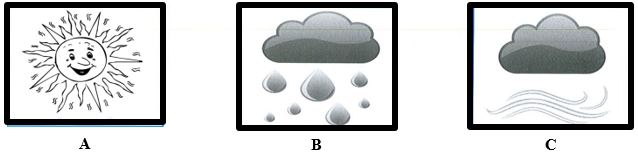
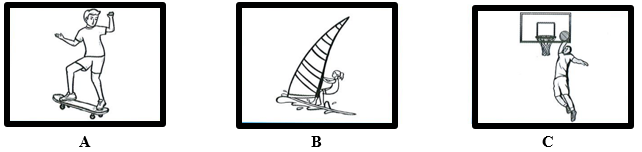
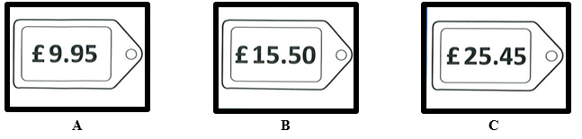
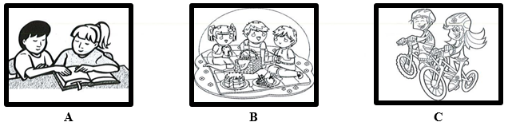
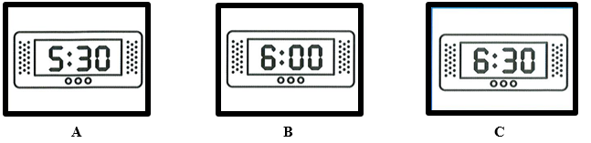

# **PART 1: Questions 1-5 ** 

*For each question, choose the correct picture. You will hear each recording twice.*

**Question 1: What was the weather like on Sunday?**

**Question 2: What will they do at the weekend?**

**Question 3: How much did the boy’s shorts cost?**

**Question 4: What will they do on Monday?**

**Question 5: What time will the girl’s father meet her teacher?**

# PART 2: Questions 6-10

For each question, choose the correct answer. You will hear the recording twice.

**You will hear Rich talking to his friend Jess about horse riding.**

**Question 6: When did Rich start riding?**

1. two weeks ago
2. earlier today
3. last month

**Question 7: Rich thought his first lesson was**

1. difficult.
2. too short.
3. a bit boring.

**Question 8:** **What did Jess have to borrow at her first riding lesson?**

1. a jacket
2. some boots
3. a hat

**Question 9: Jess says her teacher was**

1. an excellent rider.
2. a good teacher.
3. kind to children.

**Question 10: What does Rich plan to do in the future?**

1. start another hobby
2. teach his friend to ride
3. keep going to riding lessons

# PART 3: Questions 11-15 

*For each question, choose the correct answer. You will hear the recording twice.*

**You will hear Jarred talking to his friend Gemma about a party.**

**Question 11: How does Jarred feel about Jake’s party?**

1. excited
2. worried
3. surprised

**Question 12: What time does the party start?**

1. 2:30
2. 2:00
3. 3:00

**Question 13:** **Rachel is Gemma’s**

1. friend.
2. cousin.
3. brother.

**Question 14:** **The party is at**

1. 14 Green Street.
2. 24 Green Street.
3. 40 Green Street.

**Question 15:** **What sort of music does Jarred think is the best for parties?**

1. hip hop
2. pop
3. rock

# PART 4: Questions 16-20

*For each question, choose the correct answer. You will hear the recording twice.*

**You will hear two friends talking about the kind of flat they would like to live in.**

**They agree that it should**

1. be close to public transport.
2. have at least three bedrooms.
3. be on one of the higher floors.

---

**You will hear a man telling his friend about changing job.**

**How does he feel?**

1. He thinks the staff at his new firm is unfriendly.
2. He still misses his old colleagues.
3. He finds it hard to do his new job well.

---

**You will hear a woman talking about a trip to the beach.**

**What did she like best about it?**

1. swimming in the sea
2. going on a free boat trip
3. playing a sport

---

**You will hear two friends talking about the town where they live.**

**They agree that**

1. it's smaller than they would like.
2. there’s too much traffic.
3. some parts of it are dangerous.

---

**You will hear a man talking to a friend about shops.**

**What does the man think about the small shop?**

1. It sells a wide variety of items.
2. There aren’t enough assistants.
3. The prices there are reasonable.

